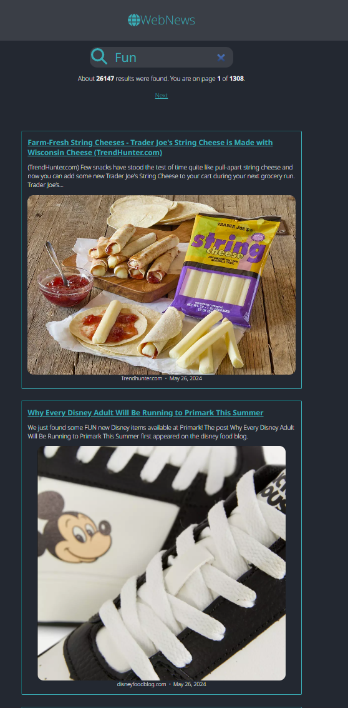

# Go News Search App

This is a basic web application built in Go that allows users to search for news articles using the News API.



## Prerequisites

Before running the application, you'll need to generate an API key from [News API](https://newsapi.org/).

Create a `.env` file in the root directory of the project containing your API key:

```plaintext
PORT=3000
NEWS_API_KEY=<api-key>
```

Replace `<api-key>` with your actual News API key.

## Build and Run

To build and run the application, execute the following commands in your terminal:

```bash
go build .
./go-app
```

This will compile the Go code and start the web server.

## Run in Development Mode

For development purposes, you can use `air` to automatically reload the server when changes are made to the code. Install `air` if you haven't already, then run the following command:

```bash
air
```

This will start the development server and monitor for changes in the codebase.

Now you can access the application in your web browser and start searching for news articles based on your query.
